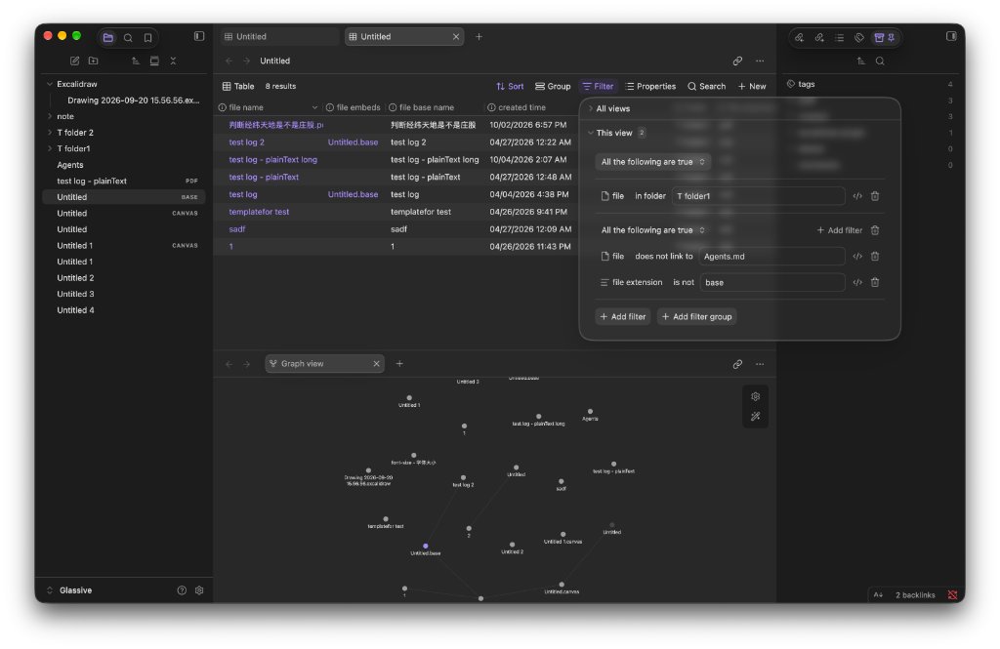
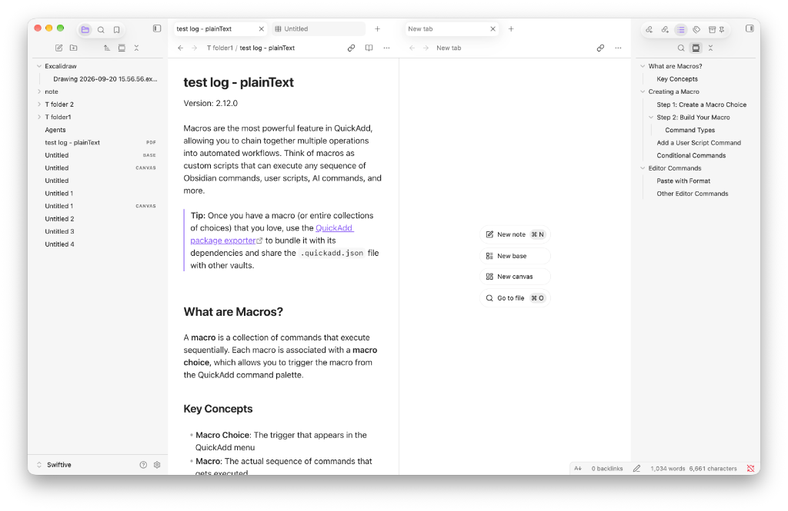

# Glassive

A theme for [Obsidian](https://obsidian.md) that blends macOS Liquid Glass with classic macOS design: restrained texture, subtle highlights, and nothing more than it needs.




## Features

- **Hand-tuned motion**: animated split panes, popovers, menus, and modals.
- **Redesigned tab bar and sidebars**: a cleaner, quieter layout.
- **Progressive blur**: applied when the window gets small, so cramped layouts stay calm.
- **Custom palettes**: separate color sets tuned for light and dark mode.

## Compatibility

- Tested on macOS only. I don't have Windows or Linux devices, so the theme hasn't been tested there.
- Not designed for mobile devices yet.

## Plugin support

Styled for the core Bases, Canvas, and File Recovery plugins, plus QuickAdd, Commander, Iconic, Modal Form, PDF++, Better Export PDF, and Another Callout Suggestions.

## Installation

In Obsidian, open **Settings → Appearance → Themes → Manage**, search for **Glassive**, then select **Install and use**.

To install manually, download `theme.css` and `manifest.json` from the [latest release](https://github.com/Flyingfolder/obsidian-glassive/releases) and put them in `<vault>/.obsidian/themes/Glassive/`.

## Development

```bash
npm install
npm run dev -- --init "/path/to/MyVault"   # first run: live-reload into a vault
npm run dev                                # afterwards
npm run build                              # compile main1.scss to theme.css
```

## License

[MIT](LICENSE)
