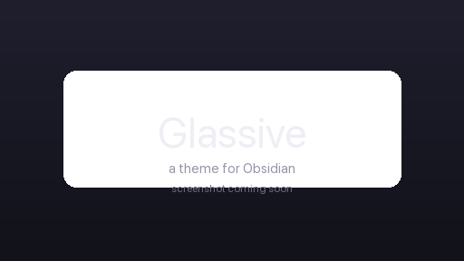

# Glassive

A calm, glassy theme for [Obsidian](https://obsidian.md) — soft layered surfaces, quieter sidebars, and a set of tab-header behaviours that keep the focus on your notes.



## Features

- **Liquid glass surfaces.** Sidebars, modals and menus use layered translucency with blurred backdrops, so content behind them stays present instead of disappearing.
- **Quieter chrome.** Slimmer dividers, tidier tab headers, a multi-tab right sidebar, and optional hiding of the Properties block in the sidebar.
- **Smooth tab transitions.** Animated tab-header containers and drop zones, plus a transition indicator while tab headers are rearranging.
- **macOS-style window controls.**
- **Styled core surfaces.** Editor, callouts, Canvas, File recovery, Settings, Community plugins, and the command palette.
- **Third-party plugin support.** Dedicated styling for Commander, Iconic, QuickAdd, Modal Form, PDF++, Better Export PDF, and callout suggestion helpers. A theme cannot break a plugin it does not target: any plugin without specific styling simply keeps Obsidian's default look.
- **Deep customization** through the [Style Settings](https://github.com/mgmeyers/obsidian-style-settings) plugin — accent colours, command palette title layout, tab-header options, and more.

## Installation

### From the community directory

1. Open **Settings → Appearance → Themes → Manage**.
2. Search for **Glassive** and select **Install and use**.

### Manual installation

1. Download `manifest.json` and `theme.css` from the [latest release](../../releases/latest).
2. Create the folder `<your-vault>/.obsidian/themes/Glassive/` and put both files in it.
3. Open **Settings → Appearance → Themes** and select **Glassive**.

## Customization

Install the [Style Settings](https://github.com/mgmeyers/obsidian-style-settings) plugin, then open **Settings → Style Settings → Glassive** to configure:

- **Accent colour** — several presets, from default through red, orange, green, blue and indigo to black.
- **Command palette layout** — title above, below, or to the right.
- **Tab header behaviour** — animated tab-change indicator, auto-collapsing headers, and the left sidebar tab header container.
- **Window controls** — show or hide the macOS-style close button.

Every option is a class toggle, so a CSS snippet can override any of them.

## Compatibility

- **Obsidian:** 1.10.6 or later
- **Modes:** dark and light
- **Platforms:** desktop and mobile

## Development

`theme.css` is **generated** — never edit it by hand. All styling lives in the SCSS sources under `main1/`.

```bash
npm install          # install dart-sass, autoprefixer and the linter
npm run build        # main1.scss → theme.css (sass + autoprefixer)
npm run watch        # rebuild on save
npm run lint         # check theme.css against the official CSS rules
npm run sync         # copy theme.css into a vault for live preview
```

`npm run sync` needs a target once:

```bash
# preview as a real theme (recommended)
npm run sync -- --init "/path/to/MyVault/.obsidian/themes/Glassive"
# or preview as a CSS snippet
npm run sync -- --init "/path/to/MyVault/.obsidian/snippets" --name main1.css
```

The target is stored in `.sync-target`, which is git-ignored.

### Project layout

```
main1.scss            entry point
main1/
  abstracts/          variables, mixins, animations, Style Settings
  base/               reset and typography
  components/         buttons, inputs, menus, modals, popovers, …
  editor/             callouts, find and replace
  pages/              settings, Canvas, community plugins, per-plugin pages
  plugins/            third-party plugin styling
  themes/             surfaces, dividers, tab headers, window controls
```

### Releasing

Pushing a tag that matches the `version` in `manifest.json` triggers the release workflow, which builds `theme.css` and creates a draft GitHub release with `manifest.json` and `theme.css` attached. Publish the draft to make the version available to users.

```bash
npm version 1.0.1     # bumps manifest.json + versions.json
git push && git push origin 1.0.1
```

## Credits

Built by [Flyingfolder](https://github.com/Flyingfolder). Some surfaces, dividers and plugin rules were written with reference to Obsidian's built-in theme and the community themes that came before.

## License

[MIT](LICENSE)

---

## 中文说明

Glassive 是一个偏「安静」的玻璃质感主题：分层半透明表面、更克制的分隔线与标签栏、可选的隐藏侧栏属性区，并针对 Commander、Iconic、QuickAdd、Modal Form、PDF++ 等插件做了适配。

- **安装**：设置 → 外观 → 主题 → 管理 → 搜索 Glassive；或手动把 release 里的 `manifest.json` 和 `theme.css` 放到 `<vault>/.obsidian/themes/Glassive/`。
- **自定义**：装 [Style Settings](https://github.com/mgmeyers/obsidian-style-settings) 插件后，在 设置 → Style Settings → Glassive 里调主色、命令面板标题位置、标签栏动效等。
- **开发**：`theme.css` 是 `main1.scss` 的编译产物，请勿直接修改；用 `npm run build` 重新生成，`npm run sync` 可同步到 vault 里实时预览。
